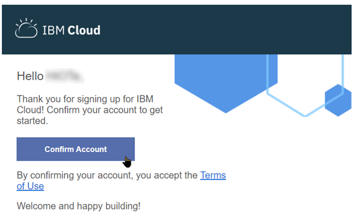

# Watson Studio
# Workshop Setup Instructions
October 12, 2018

## Overview
The IBM Watson Studio Workshop comprises Hands-On Labs which will be executed by the workshop participants on IBM Cloud instances, using a web browser running on their own laptops, PC, Mac or true Linux.

The IBM Watson Studio environment leverages IBM Cloud (formerly Bluemix) infrastructure and accounts.   
To speed-up the Hands-On lab, it is advisable that participants setup their IBM Cloud environment prior to the workshop, following the instructions provided in this document.

In order to level-set the Labs environment, it is recommended that participant will run the Hands-On exercises using a new IBM Cloud free ’lite plan’ account.   
Participants already having an IBM Cloud account can still use it if they wish so, but there may be some discrepancies in the instructions.

Note that Watson Studio projects that will have been developed under a new free ’lite plan’ account can be shared with existing account for further re-use.

**Note:** Instructions for the hands-on labs will be provided in `.pdf` format, if you have access to a tablet, please bring it along to display the instructions as it will be more practical than sharing space on the laptop's screen.   
See the last section of this document for reference to a screen sharing utility that can bring further ease of use.

## Create an IBM Cloud account

1.	You will need to have an e-mail address (possibly an alias for a main e-mail address) available, one which has never been used to setup an IBM Cloud (or Bluemix) account.
1.	From a web browser, navigate to: https://console.bluemix.net/registration/
1. Enter the requested details such as e-mail address, First and Last Names.  
---
>**NOTE**: Most of the lab exercices assume that you have selected ***United States*** as Country or Region. If you select another one, you may need to adjust some of the lab instructions to accomodate for a different location for services and have to use URLs prefixed with `eu-gb` or `eu-de` 

---
5. You may have to validate a captcha, then wait until you get registration confirmation e-mail 
6. Confirm registration from the e-mail:  by clicking on `[Confirm Account]`
7. This should lead you to the IBM Cloud account confirmation

You can then verify that IBM Cloud account is in order by clicking on the `[Log in]` button and acknowledge the privacy notice, then click `[Proceed]`
8. You should be taken to the IBM Cloud main dashboard page: 

**Congratulations, your now have a new IBM Cloud environment. You are now ready to run the Watson Studio workshop’s Hands-On Labs.**

## Additional practical information
The Hands-On Labs will be run in part following instructions provided in PDF form, so having a tablet available can facilitate operations.

All Cut&Paste information can be accessed from a browser window on the PC/Mac.

You may want to use iDisplay (https://getidisplay.com/), where the tablet can even extend the Windows or Mac desktop:
 
