# Lab part 1: Build a logistic regression model with IBM Watson Machine Learning

Adapted from [Tutorial: Build a logistic regression model with Watson Machine Learning](https://datascience.ibm.com/docs/content/analyze-data/ml-example-log-regress.html)

In this tutorial, you will build a logistic regression model that assesses the likelihood that a customer of an outdoor equipment company will buy a tent.

The input data used for training the model has a record of customer profile features together with their buying decision.

## Preparation
Switch to the `DSX_Workshop` project, where you should have a Spark service instance available.   
For more detailed information about setting up your machine learning environment, refer back to Lab 1.

### Provide data to your project
Ensure that the `GoSales_Tx.csv` file is part of the data assets for the project, oherwise ad it from the workshop's Box folder, referring to Lab 1 for instructions.

Also, refer to Lab 1 for insights on the Data Asset.

## Model training
### Create a model
1. From the project page click Add to project > Model.
2. Name the model e.g. `TentBuyingPredictor`.
3. Select the Machine Learning service.
   * If none exists, create one using the Lite plan defaults 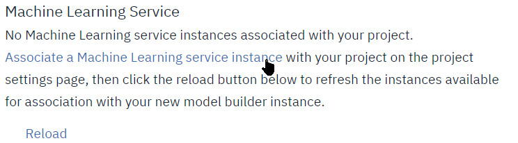
   * Click `Associate a Machine Learning service instance`, this opens a new tab where you can create the ML Service instance.
   * Select the Lite plan and accept de defaults 
   * Back to the Model definition page, click **Reload** and select the newly created Machine Learning Service.
4. Select the model type as `Model Builder`
4. Select the Spark service
   * Under Spark Service, select the Manual box on the right
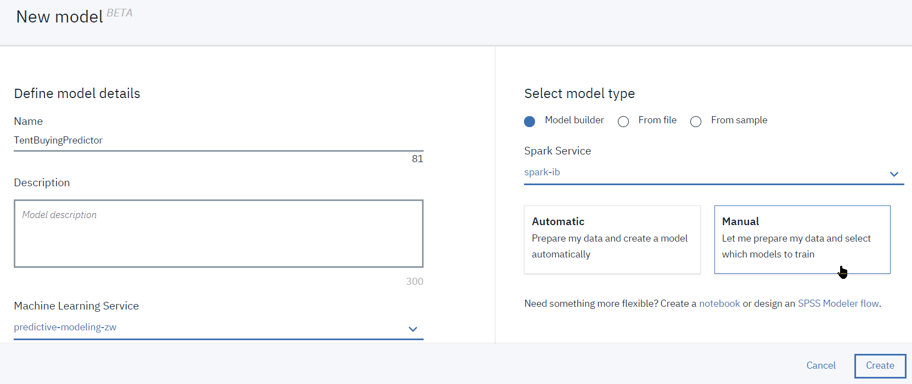
5. Click **Create**
6. Once created, you are taken to the 'Select data asset' page, select the `GoSales_Tx.csv` file and click `Next`.
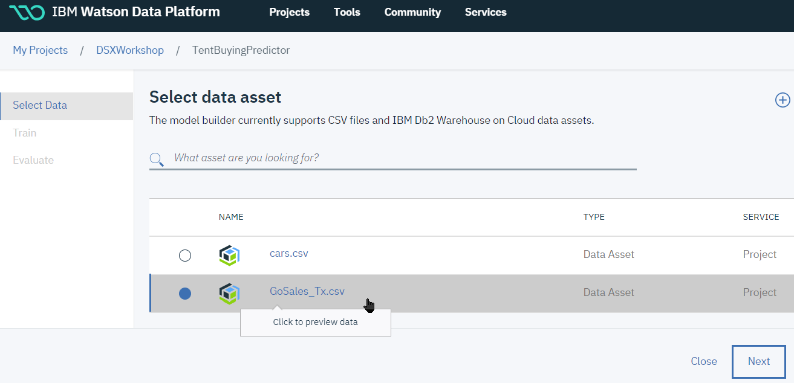

### Train the model
After you load the data, you must **train** the model.   
This consists of choosing an appropriate technique and estimator to apply to the raw data.   
For this data set, we will predict the buying behavior, represented in the `IS_TENT` column.
We will use Logistic Regression estimator for the following reasons:
1. A logistic regression enables you to use multiple explanatory variables that can be ordinal, continuous, or dichotomous.
2. A logistic regression gives a quantified value for the strength of the prediction, controlling for other factors.
3. For this particular analysis the receiver operator characteristic (ROC) produces an excellent performance result.

#### Steps
1. On the 'Select a technique' page, for the 'Column value to predict', select `IS_TENT`: 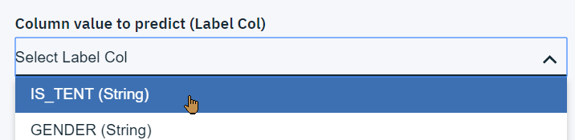
1. Keep `All (default)` for the feature columns. If the dataset had included for example an Customer_ID column, we would have removed it from the features as being a unique identifier it should have no impact on the buying behavior.
2. For the technique, select Binary Classification:
3. To add and configure an estimator
   * click `Add Estimators` 
   * select `Logistic Regression` 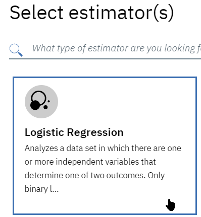
   * click **Add**.

4. Click **Next**. This will start training the model 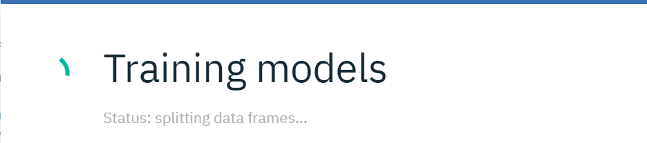

After the training completes, on the `Select model` page, **click** the model you just created, and then, click **Save**, and confirm **Save** again.   
   

The model is now trained and ready for execution.

### Deploy and test
After you train and save the model, you must deploy it. This is also a good time to do a check on the data and the results.

#### Steps

1. On the model page, switch to the `Deployment` tab and click `Add Deployment`.  

2. On the `Create Deployment` page, select the `Web Service` deployment type, and enter a deployment name, e.g. `Tent_Scoring`, then **Save**  
3. When model deployment is complete, you can View the details clicking on `Actions` and `View` 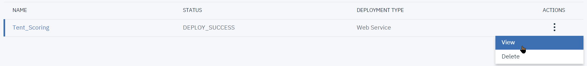.
4. The `Implementation` tab gives information on endpoint URL, as well as a few invocation examples in cURL, Python, ... The credentials would need to be obtained from the **IBM Watson Machine Learning** service definition in IBM Cloud.
4. Test the model prediction:
   1. From the details view, switch to the `Test` tab: 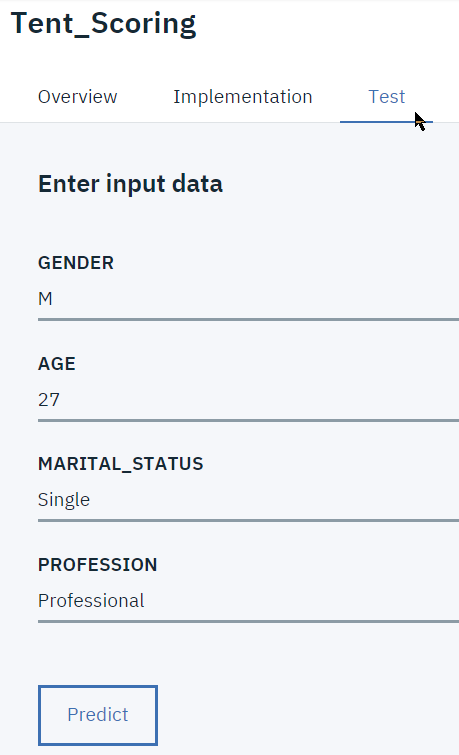
   2. A sample input data record is populated with a sample record from the data set.
   3. To test the model, change the values and click **Predict**. The scoring result is displayed: 

### Summary
You successfully completed this machine learning tutorial!   
You learned how to use the model builder to predict the likelihood that someone will buy a tent.

### Stretch Lab Part 2: run the model from a python notebooks
The model just deployed can be invoked from a notebook, you may want to run through the `Lab4-Part2-RunModelFromNotebook_cleared.ipynb` notebook.  

Before creating the notebook, you may want to record your **IBM Watson Machine Learning Service** credentials, and `Tent_Scoring` endpoint code:
* In the `Tent_Scoring` deployment, select `View` from the menu 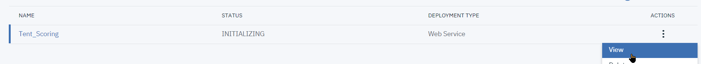
* Select the `Implementation` tab, and then under `Code Snippets`, the `Python` tab 
* **Copy** the code in the light blue box to a notepad document for later reference

* From the main menu bar, select the `Services` menu and then the `Compute Services` 
* In the `Machine Learning` section, locate your service, and select `Manage in IBM Cloud` from its menu 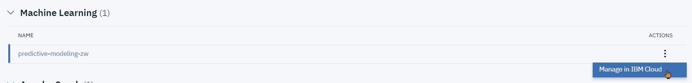
* Select the `Service Credentials` tab 

* Expand `View Credential`, and copy&paste the contents of the blue box (between curly braces { } to a notepad document 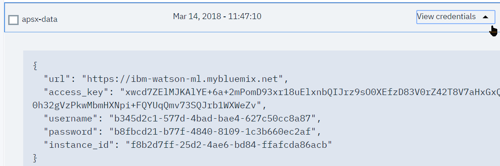

 Now you can switch back to **IBM Watson Studio** and add a notebook from the `Lab4-Part2-RunModelFromNotebook_cleared.ipynb` file and follow the instructions from the Notebook.

# Lab part 2 - Flow Modeler (Optional)

## Overview
We will Build a predictive analytic model to determine whether a person has chronic kidney disease by using IBM Watson Machine Learning, and the Flow Editor with Spark MLlib nodes

You will use classification transformers with publicly available data about metabolic diseases from the University of California, Irvine to determine whether someone has chronic kidney disease or not.

Prerequisites: Ensure that you have at least one Spark service instance available and at least one project.

## Preparation
This tutorial machine learning model in IBM Watson Studio contains steps to get data fom an external source by using the Watson Studio flow creation tool: the Flow Editor. You can then explore the data before you deploy it.

Add research data to your Watson Studio project:   
The original source for this data is from the University of California, Irvine (UCI) and is available at the UCI Machine Learning Repository at https://archive.ics.uci.edu/ml/datasets/Chronic_Kidney_Disease

## Background:
The data set is the result of an extensive study based on hospital admissions over a period of time. Because of the types of tests that were performed as part of hospital admissions, the following items are available as part of this analysis:

* __serum creatinine (sc)__: A serum creatinine test measures the level of creatinine in your blood and provides an estimate of how well your kidneys filter.
* __age (age)__: The age of the test subject.
* __diabetes mellitus (dm)__: A group of metabolic diseases in which there are high blood sugar levels over a prolonged period

These items are strikingly important when predicting chronic kidney disease. Some other fields are relatively important (e.g., blood pressure), but were omitted from the features list arbitrarily.

1. Download the `chronic_kidney_disease_full.csv` file.
Add the file to the data assets for the project. Click add data assets, click browse, select the data file, click Open, and then click Apply.
1. Create a machine learning flow.
From the project assets tab page, navigate to `Modeler Flows` and click `New Flow` 
1. Type a name and description for the machine learning flow, select `Modeler Flow`, and `IBM SPSS Modeler` for the runtime, and `[Create]` 
1. The Flow Editor should open. Drag&Drop the `Data Asset` icon from the `Import` drawer onto the canvas: 
1. double-click the data asset node and change the data asset 
1. Select the `chronic_kidney_disease_full.csv` file. Don't forget to `[Save]` with the button at the bottom right

## Transform and train the data
After you load the data, you must transform the data by using transformers. You will be creating a simple machine learning flow by dragging transformers and estimators onto the Flow Editor and connecting them to the data source.

1. Open the palette by clicking the palette node .
1. Add the following nodes from the palette:
    1. Filter rows: click the `Record Operations` tab and drag the `Select` node to the Flow Editor
    2. Wire the node to the data asset node, by hovering near the data asset node, clicking the highlighted area and dragging a connector to the Select node. 
    3. Configure the Select node to limit the data to the high-risk group of people over the age of 40 years. Double-click the node to open its properties and enter `Mode` `Discard` and `Condition` `age<40` 
    1. Remove columns to clean up the data, we will remove some of the columns that are not necessary to the analysis or that have missing data points. For this, you use the `Filter` node from the `Field Operations` drawer, drop to canvas and wire to the previous `Select` node: 
    1. Double-click the Filter node, expand the Settings section, and click Add Columns. Because the following fields have many missing values, remove them by selecting them in the list: sg, al, su, rbc, pc, pcc, ba, bgr, bu, sod, pot, hemo, pcv, wbcc, rbcc, htn, cad, appet, pe, and ane, and then click OK.
    1. make sure the Mode section is set to the filter the selected fields and click `[Save]` 
    1.When you finish this portion of the tutorial, your machine learning flow should look like the following image: 
    1. Set target for decision: Add a `Type` node from `Field Operations` drawer, connect to Filter node: 
    1. Add a classification algorithm. 
      1. Double-click to open properties, and Click on configure types. Add column name `class`, change role to target hit ok  and then save:
      1. One more step before building the classification model is to divide data into train and test sets. We will use the Partition node for this. Drop it on the canvas, wire to Type node, open properties to set partition to 70/30: 
      1. Finally let’s fit the classification model. We will be using a C5.0 algorithm to build a decision tree . A C5.0 model works by splitting the data based on the field that provides the maximum information gain.You can see node `C5.0` under the `Modeling` section of the nodes palette. 
  1. Run and deploy the model. After you create the machine learning flow, you must run and then deploy it. 
  1. Once you run your decision tree model you will be able to see your model in a golden color node. 
  1. Right-click on the golden color node and view the model. You can see predictor importance, tree diagram, and other model information here.
  1. To evaluate the performance of the model, select the Analysis node from the Output section of the node palette and connect it with the model. Similarly, use the Table node to view data in a table format with predicted labels and confidence: 
  1. Open the Analysis view result, here we have achieved 95% accuracy on our test data set with this model 

What does this tell us? While this example is basic in nature, it provides insight into the fact that older people tend to have a higher probability of getting chronic kidney disease than younger people, controlling for other factors. It also shows the importance of serum creatinine in diagnosing kidney disease.

