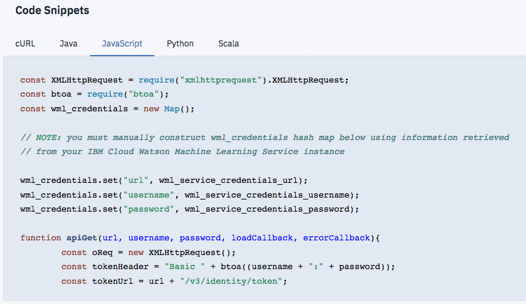
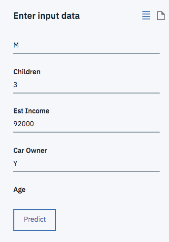
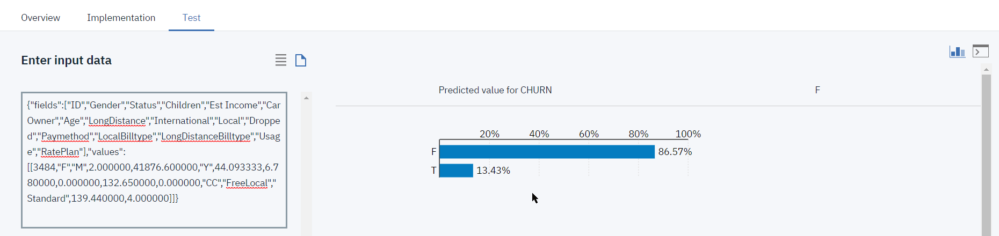

# Lab5 part 1: Introduction to Machine Learning with Watson Studio

**Build train, and deploy a machine-learning model without coding and invoke it from a notebook**

Get experience with **IBM Watson Studio** by creating a decision-tree machine-learning model to evaluate the risk that a customer might leave your service.

**Duration:** 20 minutes

**Experience:** clicker + optional coder

In this tutorial, you use **IBM Watson Studio** to train and deploy a machine-learning model without any coding or manual model building skills.

You complete the following tasks:
  * Create a project (unless you have already an existing project)
  * Load a data set into the project
  * Use the IBM Watson Studio model builder to train, test, and evaluate a machine-learning model
  * Deploy the model

## Prepare a project in IBM Watson Studio
In IBM Watson Studio, data scientists work and collaborate in projects. In this task, you set up a project.

---
> **If you have already completed previous labs on IBM Watson Studio, jump directly to the Assets section on bullet 7.**
---
1. Go to **<https://dataplatform.cloud.ibm.com>** to access IBM Watson studio cloud-based service.  

2. Click **Login** and provide your IBM ID credentials.  

3. When logged in to IBM Watson Studio the first page that you see is the **Get started with key tasks** which helps you to get a customizable user experience whether you are a data scientist, a data engineer... You can minimize this pane clicking **Hide**.
If you scroll, you can explore the **Community Page** where you can distribute public assets, such as notebooks and data sets, which can be used by any IBM Watson Studio user. Community page is also a great way to grow your data scientist skills.  

4. In the upper-right corner, click the **+ New Project** link, to create project. Alternatively you can use an existing project.
The "New project" page opens and lists a set of templates (tiles) which tailor the tools based on the tasks you want to accomplish.
Select **Modeler**.  

5. Give your project a name, let's say `CustomerChurn`, a detailed description.  

6. Click **Create**.
On the project's summary page, you can see that the project has no assets.  

7. Click **Assets**.
The various project components are shown, such as notebooks, models, and data sets. You're going to add a data set to the project.  

8. **Data sets** can be local or remote. In this tutorial, you work with a small local data set.  

**Click the Find and add Data** icon which looks like a 10 01 button. It will open the file management sidebar.  

9. From the **Load** tab, Click **Browse** to select from your local file system.
Navigate to the lab files folder (given by your instructor) and select `customer_churn.csv`  and click **Open**.
Alternatively, you can drag and drop a file directly into the sidebar.
The file is added to your local data sets in your project.

Next, you will create a machine-learning model by using this newly loaded data set.

## Create the model
Create a model by using the IBM Watson Studio model builder.

1. Scroll to the **Models** section of the project.
   A project can host several models of different types:
   + Natural Language Classifier models
   + Visual Recognition models
   + Watson Machine Learning models  
1. Click **+ New Watson Machine Learning Model**: 
On the New Model page, the `Model builder` model type is selected by default.
Give a name to the model, `customerchurn` for example.
The model builder can be fully automated or can leave certain steps to be completed manually. In this tutorial, you use the manual option so that you can review the capabilities of the model builder.
1. An **IBM Watson Machine Learning Service** is required:
   1. Click on  `Associate a Machine Learning service instance`  
   1. Create a new Lite/Free plan instance: 
   1. Once created, switch back to the model creating tab and click `[Reload]`  to select your newly created instance.
1. Make sure you have selected A **Spark Service**
1. Click **Manual** to get more options in data selection for training your model:   
1. Click `[Create]`  
1. On the "Select data asset" page, you can select the data asset to use to create your model.
   * Use the  button to upload `customer_churn.csv`
   * then select it and click **Next**.   
1. On the "Select a technique" page, you select the attributes of the machine-learning model.
From the **Column value to predict (Label Col)** list, select **CHURN**. This is the column that contains the historical observations and thus the outcome to predict.
The **Feature columns** are columns that contain the attributes on which the machine learning model will base predictions. All columns (features) are selected by default, you can leave it as-is or select **all BUT the ID column**.
1. The model builder selects **Binary Classification** by default as the type of model to build. Because you want to create that type of model, leave the selection as-is.
1. In the upper-right corner, click **Add Estimators** to select the type of machine-learning algorithm to train.
1. On the "Select estimator(s)" window, from among the four algorithms, click **Random Forest Classifier** and **Gradient Boosted Tree Classifier**. Click **Add**.
   > The estimators (machine-learning algorithms) are shown on the next page, where you can also modify the percentage split between training, testing, and validation sets. Leave the default settings as-is.   

   
1. Click **Next**.
   The two models are trained and their respective evaluations are displayed. Depending on  the way the test set has been (randomly) spliced, either one of the estimators will come out with slightly better performance results.
   
   The ROC (Receiver Operating Characteristic) and PR (Precision Recall) Area Under Curve (AUC) are metrics used to evaluate the accuracy of a model's true positive and true negative predictions, evaluated on the test subset.
1. Select the `RandomForestClassifier` and click **Save**. When you're prompted to confirm, click **Save** again.
You're returned to the **Models** summary page, on the **Overview** tab, where your new model is listed.

You now have a trained model, next you will deploy the model to test on out-of-sample data.

## Deploy and test a trained model
Before you can use your trained model to make predictions on new data, you must deploy the model. It's time to deploy the model and start to score a few records.

1. From the model summary page, click the **Deployments** tab.  
1. Click **Add Deployment** link on the upper-right section of the pane   
1. On the **Create Deployment** page, give a name and a description to your deployment, say `CustomerChurnDeploy`.
   > Note that deployments must have a unique name.    

   

1. By default **Web service** is selected as the deployment type. Click **Save**.
   > **Batch prediction** and **Realtime streaming prediction** are deployment types for continuous learning and model evaluation. For **Batch Prediction** source could be a file in your **IBM Cloud Object Storage** or a connection and table from **IBM DB2 Warehouse on Cloud**.    
   For **Real-time Streaming** the source is a streaming data source from a **Message Hub** instance.  

1. When model deployment is complete, from the **Actions menu**, click **View**. Alternatively you can click on the Deployment name. The **Deployment Details** window appears.  
1. Click on the **Implementation** tab. Note the scoring end point for future reference. **You can only have one deployment per user**.
   > The **Code Snippets** are available to pass it on to you application developer to integrate the deployed model into a business application.  

     

1. Now is a good time to test the model prediction. Go to **Test** tab.  
1. Enter data in all the fields for a sample record from the data set.   

   Get data from the `new_customer_churn_data.csv` file or copy the data from here and paste into the `Input JSON Payload data`:
``` JS
{"fields":
["ID","Gender","Status","Children","Est Income","Car Owner","Age",
"LongDistance","International","Local","Dropped","Paymethod",
"LocalBilltype","LongDistanceBilltype","Usage","RatePlan"],
"values":[
[3484,"F","M",2.000000,41876.600000,"Y",44.093333,
6.780000,0.000000,132.650000,0.000000,"CC",
"FreeLocal","Standard",139.440000,4.000000]
]}
```
     

9. To test the model click **Predict**: 
   Here the prediction is that customer will not churn at 86% chance.
1. You can test several out-of-sample records provided as a payload in JSON format. Click on the **document** icon.  
    
  Copy-paste the JSON from a text editor and click **Predict**.  
The results of scoring the tuple (tuples) against the model are shown either in raw data format or as an output chart.

### Stretch Lab Part 2: run the model from a python notebooks
The model just deployed can be invoked from a Jupyter notebook.   
This is implemented in the `Lab5-Part2-RunModelFromNotebook.ipynb` notebook. This can be a first step towards integrating a ML model into an application.

Before creating the notebook, you may want to record ML Service credentials, and scoring web service endpoint code:
* In the scoring deployment, select `View` from the menu 
* Select the `Implementation` tab, and then under `Code Snippets`, the `Python` tab 
* Copy the code in the light blue box to a notepad document for later reference

* From the main menu bar, select the `Services` menu and then the `Compute Services` 
* In the `Machine Learning` section, locate your service, and select `Manage in IBB Cloud` from its menu 
* Select the `Service Credentials` tab 

* Expand `View Credential`, and copy&paste the contents of the blue box (between curly braces { } to a notepad document 
 
 Now you can switch back to Watson Studio and add a notebook from the `Lab4-Part2-RunModelFromNotebook.ipynb` file

# Lab part 2 - Flow Modeler (Optional)

## Overview
We will Build a predictive analytic model to determine whether a person has chronic kidney disease by using IBM Watson Machine Learning, and the Flow Editor with Spark MLlib nodes

You will use classification transformers with publicly available data about metabolic diseases from the University of California, Irvine to determine whether someone has chronic kidney disease or not.

Prerequisites: Ensure that you have at least one Spark service instance available and at least one project.

## Preparation
This tutorial machine learning model in IBM Watson Studio contains steps to get data fom an external source by using the Watson Studio flow creation tool: the Flow Editor. You can then explore the data before you deploy it.

Add research data to your Watson Studio project:   
The original source for this data is from the University of California, Irvine (UCI) and is available at the UCI Machine Learning Repository at https://archive.ics.uci.edu/ml/datasets/Chronic_Kidney_Disease

## Background:
The data set is the result of an extensive study based on hospital admissions over a period of time. Because of the types of tests that were performed as part of hospital admissions, the following items are available as part of this analysis:

* __serum creatinine (sc)__: A serum creatinine test measures the level of creatinine in your blood and provides an estimate of how well your kidneys filter.
* __age (age)__: The age of the test subject.
* __diabetes mellitus (dm)__: A group of metabolic diseases in which there are high blood sugar levels over a prolonged period

These items are strikingly important when predicting chronic kidney disease. Some other fields are relatively important (e.g., blood pressure), but were omitted from the features list arbitrarily.

1. Download the `chronic_kidney_disease_full.csv` file.
Add the file to the data assets for the project. Click add data assets, click browse, select the data file, click Open, and then click Apply.
1. Create a machine learning flow.
From the project assets tab page, navigate to `Modeler Flows` and click `New Flow` 
1. Type a name and description for the machine learning flow, select `Modeler Flow`, and `IBM SPSS Modeler` for the runtime, and `[Create]` 
1. The Flow Editor should open. Drag&Drop the `Data Asset` icon from the `Import` drawer onto the canvas: 
1. double-click the data asset node and change the data asset 
1. Select the `chronic_kidney_disease_full.csv` file. Don't forget to `[Save]` with the button at the bottom right

## Transform and train the data
After you load the data, you must transform the data by using transformers. You will be creating a simple machine learning flow by dragging transformers and estimators onto the Flow Editor and connecting them to the data source.

1. Open the palette by clicking the palette node .
1. Add the following nodes from the palette:
    1. Filter rows: click the `Record Operations` tab and drag the `Select` node to the Flow Editor
    2. Wire the node to the data asset node, by hovering near the data asset node, clicking the highlighted area and dragging a connector to the Select node. 
    3. Configure the Select node to limit the data to the high-risk group of people over the age of 40 years. Double-click the node to open its properties and enter `Mode` `Discard` and `Condition` `age<40` 
    1. Remove columns to clean up the data, we will remove some of the columns that are not necessary to the analysis or that have missing data points. For this, you use the `Filter` node from the `Field Operations` drawer, drop to canvas and wire to the previous `Select` node: 
    1. Double-click the Filter node, expand the Settings section, and click Add Columns. Because the following fields have many missing values, remove them by selecting them in the list: sg, al, su, rbc, pc, pcc, ba, bgr, bu, sod, pot, hemo, pcv, wbcc, rbcc, htn, cad, appet, pe, and ane, and then click OK.
    1. make sure the Mode section is set to the filter the selected fields and click `[Save]` 
    1.When you finish this portion of the tutorial, your machine learning flow should look like the following image: 
    1. Set target for decision: Add a `Type` node from `Field Operations` drawer, connect to Filter node: 
    1. Add a classification algorithm. 
      1. Double-click to open properties, and Click on configure types. Add column name `class`, change role to target hit ok  and then save:
      1. One more step before building the classification model is to divide data into train and test sets. We will use the Partition node for this. Drop it on the canvas, wire to Type node, open properties to set partition to 70/30: 
      1. Finally let’s fit the classification model. We will be using a C5.0 algorithm to build a decision tree . A C5.0 model works by splitting the data based on the field that provides the maximum information gain.You can see node `C5.0` under the `Modeling` section of the nodes palette. 
  1. Run and deploy the model. After you create the machine learning flow, you must run and then deploy it. 
  1. Once you run your decision tree model you will be able to see your model in a golden color node. 
  1. Right-click on the golden color node and view the model. You can see predictor importance, tree diagram, and other model information here.
  1. To evaluate the performance of the model, select the Analysis node from the Output section of the node palette and connect it with the model. Similarly, use the Table node to view data in a table format with predicted labels and confidence: 
  1. Open the Analysis view result, here we have achieved 95% accuracy on our test data set with this model 

What does this tell us? While this example is basic in nature, it provides insight into the fact that older people tend to have a higher probability of getting chronic kidney disease than younger people, controlling for other factors. It also shows the importance of serum creatinine in diagnosing kidney disease.

