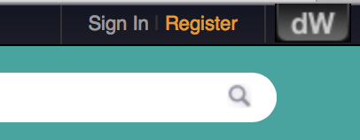

# Lab 6 - Optimization

In this lab we are learning how to do basic optimization with CPLEX and Jupyter Notebook. To complete lab you need to sign up for trial period in **Decion Optimization on Cloud service**.

You can sign up to **Decion Optimization on Cloud service** go to https://developer.ibm.com/docloud/ and press register button which is located to top-right corner

