# Build a logistic regression model with IBM Watson Machine Learning

Adapted from [Tutorial: Build a logistic regression model with Watson Machine Learning](https://datascience.ibm.com/docs/content/analyze-data/ml-example-log-regress.html)

In this tutorial, you will build a logistic regression model that assesses the likelihood that a customer of an outdoor equipment company will buy a tent.

The input data used for training the model has a record of customer profile features together with their buying decision.

## Preparation
Switch to the `DSX_Workshop` project, where you should have a Spark service instance available.   
For more detailed information about setting up your machine learning environment, refer back to Lab 1.

### Provide data to your project
Ensure that the `GoSales_Tx.csv` file is part of the data assets for the project, oherwise ad it from the workshop's Box folder, referring to Lab 1 for instructions.

Also, refer to Lab 1 for insights on the Data Asset.

## Model training
### Create a model
1. From the project page click Add to project > Model.
2. Name the model e.g. `TentBuyingPredictor`.
3. Select the Machine Learning service.
   * If none exists, create one using the Lite plan defaults 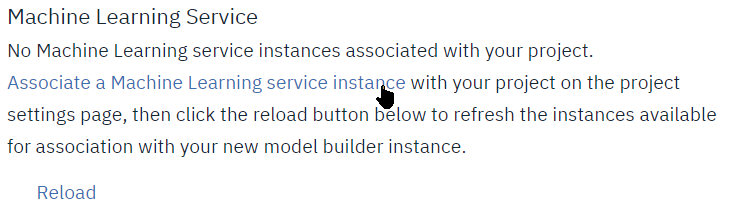
   * Click `Associate a Machine Learning service instance`, this opens a new tab where you can create the ML Service instance.
   * Select the Lite plan and accept de defaults 
   * Back to the Model definition page, click **Reload** and select the newly created Machine Learning Service.
4. Select the model type as `Model Builder`
4. Select the Spark service
   * Under Spark Service, select the Manual box on the right
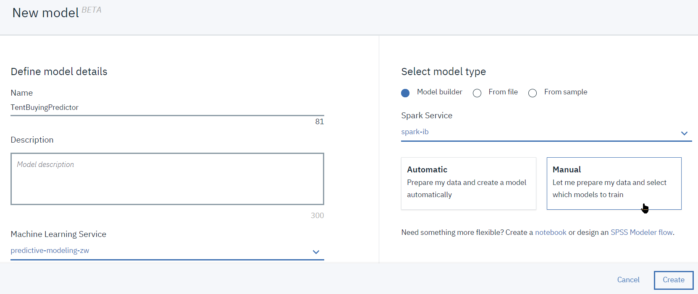
5. Click **Create**
6. Once created, you are taken to the 'Select data asset' page, select the `GoSales_Tx.csv` file and click `Next`.
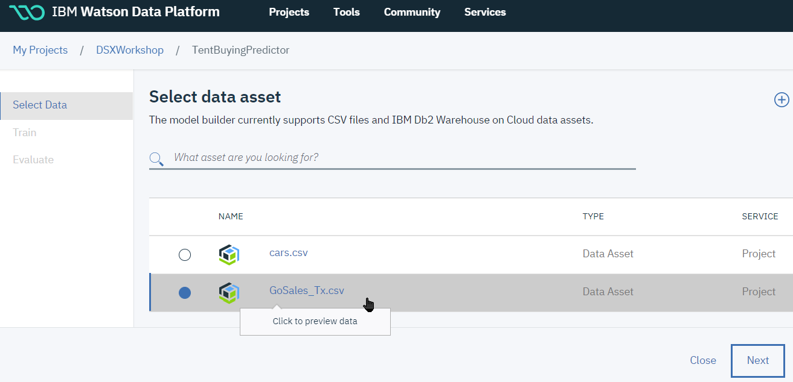

### Train the model
After you load the data, you must **train** the model.   
This consists of choosing an appropriate technique and estimator to apply to the raw data.   
For this data set, we will predict the buying behavior, represented in the `IS_TENT` column.
We will use Logistic Regression estimator for the following reasons:
1. A logistic regression enables you to use multiple explanatory variables that can be ordinal, continuous, or dichotomous.
2. A logistic regression gives a quantified value for the strength of the prediction, controlling for other factors.
3. For this particular analysis the receiver operator characteristic (ROC) produces an excellent performance result.

#### Steps
1. On the 'Select a technique' page, for the 'Column value to predict', select `IS_TENT`: 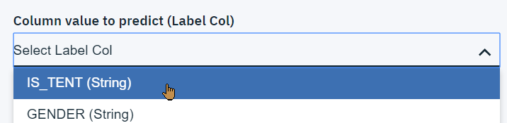
1. Keep `All (default)` for the feature columns. If the dataset had included for example an Customer_ID column, we would have removed it from the features as being a unique identifier it should have no impact on the buying behavior.
2. For the technique, select Binary Classification:
3. To add and configure an estimator
   * click `Add Estimators` 
   * select `Logistic Regression` 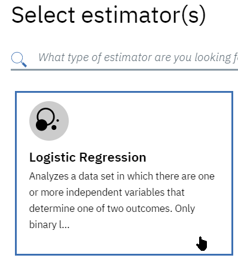
   * click **Add**.

4. Click **Next**. This will start training the model 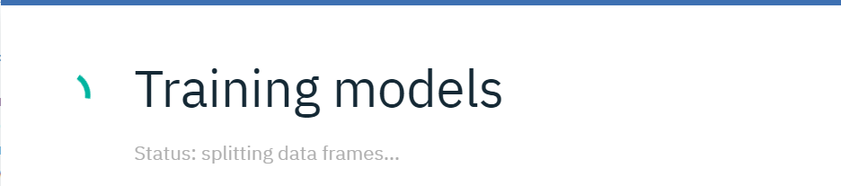

After the training completes, on the `Select model` page, **click** the model you just created, and then, click **Save**, and confirm **Save** again.   
   

The model is now trained and ready for execution.

### Deploy and test
After you train and save the model, you must deploy it. This is also a good time to do a check on the data and the results.

#### Steps

1. On the model page, switch to the `Deployment` tab and click `Add Deployment`.  

2. On the `Create Deployment` page, select the `Web Service` deployment type, and enter a deployment name, e.g. `Tent_Scoring`, then **Save**  
3. When model deployment is complete, you can View the details clicking on `Actions` and `View` 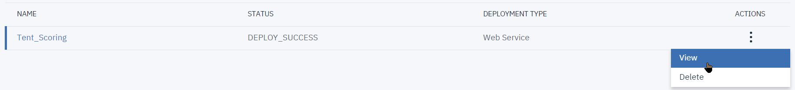.
4. The `Implementation` tab gives information on endpoint URL, as well as a few invocation examples in cURL, Python, ... The credentials would need to be obtained from the **IBM Watson Machine Learning** service definition in IBM Cloud.
4. Test the model prediction:
   1. From the details view, switch to the `Test` tab: 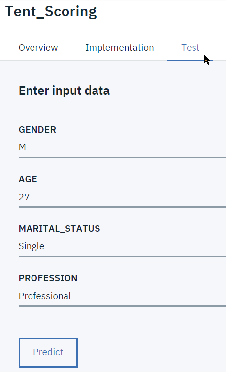
   2. A sample input data record is populated with a sample record from the data set.
   3. To test the model, change the values and click **Predict**. The scoring result is displayed: 

### Summary
You successfully completed this machine learning tutorial!   
You learned how to use the model builder to predict the likelihood that someone will buy a tent.

### Stretch Lab Part 2: run the model from a python notebooks
The model just deployed can be invoked from a notebook, you may want to run through the `Lab4-Part2-RunModelFromNotebook_cleared.ipynb` notebook.  

Before creating the notebook, you may want to record your **IBM Watson Machine Learning Service** credentials, and `Tent_Scoring` endpoint code:
* In the `Tent_Scoring` deployment, select `View` from the menu 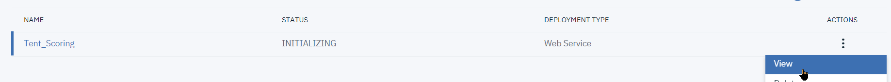
* Select the `Implementation` tab, and then under `Code Snippets`, the `Python` tab 
* **Copy** the code in the light blue box to a notepad document for later reference

* From the main menu bar, select the `Services` menu and then the `Compute Services` 
* In the `Machine Learning` section, locate your service, and select `Manage in IBM Cloud` from its menu 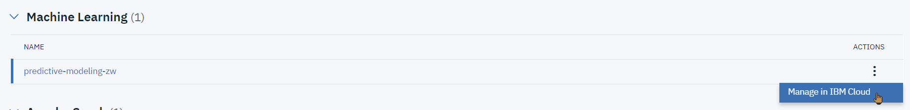
* Select the `Service Credentials` tab 

* Expand `View Credential`, and copy&paste the contents of the blue box (between curly braces { } to a notepad document 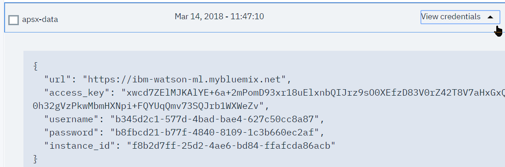

 Now you can switch back to **IBM Watson Studio** and add a notebook from the `Lab4-Part2-RunModelFromNotebook_cleared.ipynb` file and follow the instructions from the Notebook.
