# Advanced Machine Learning: Continuous Learning Lab
This lab is based on https://medium.com/ibm-data-science-experience/continuous-learning-on-watson-data-platform-cc39f3fd5042 by Adam Massachi

## Introduction
We hear from many clients that one of the hardest parts of machine learning is closing the feedback loop. This means that models need to be monitored and updated frequently to incorporate the latest data.

Watson Machine Learning and Watson Studio allow data scientists and analysts to quickly build and prototype models, to monitor deployments, and to learn over time as more data become available. Performance Monitoring and Continuous Learning enable machine learning models to retrain on new data supplied by the user or another data source.   
Then, all of your applications and analysis tools which depend on the model are automatically updated as Watson Studio handles selecting and deploying the best model.

## Lab description
In this hands-on lab, we will solve a problem for the City of Chicago using the Model Builder to model building violations.   
We’ll predict which buildings are most likely to fail buildings inspections.   
Then, we can intelligently rank the buildings by their likelihood to fail an inspection, saving time and resources for the City and for our inspectors.

We’ll start building a model on publicly available data from 2017, starting in September before we introduce October, November, and December data to simulate learning over time.

You’ll need Watson Studio, Watson Machine Learning, and IBM Db2 Warehouse on Cloud connection which will be provided by the instructor.

## Train a model on building inspection dataset
1. Add `buildings_data_17.csv` as a Data Asset in your project.
   Have a look at what columns are defined using the preview: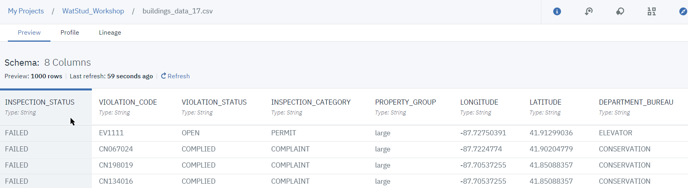
   We will want to predict the value of the `INSPECTION_STATUS` class based on the other attributes.
1. Create a new Watson Machine Learning Model `BuildingViolationsChicago`: 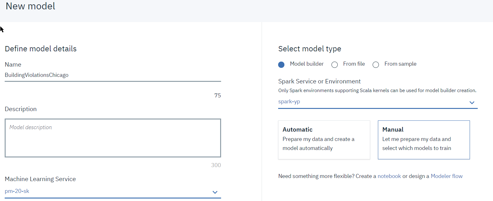, using Manual mode.
1. Select the `buildings_data_17.csv` as Input file: 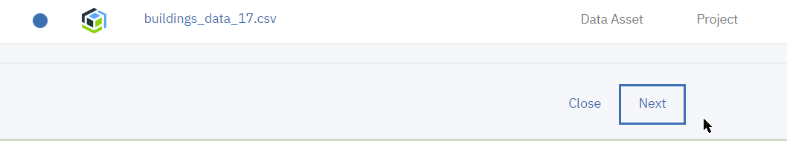
1. Train a model:
    1. Select `INSPECTION_STATUS` as the value to predict: 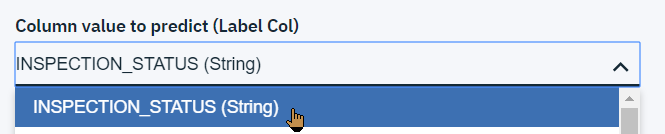
    1. Keep the default for the features column (all): 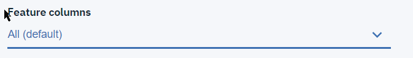
    1. Chose Binary Classification technique
    1. Add Logistic Regression as Estimator: 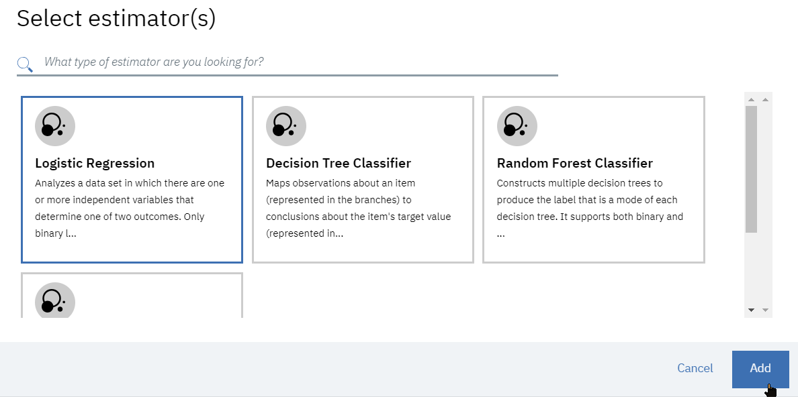
    1. Run the training by clicking on `[Next]` button 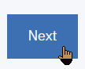
    1. Once trained, Save the Logistic Regression model 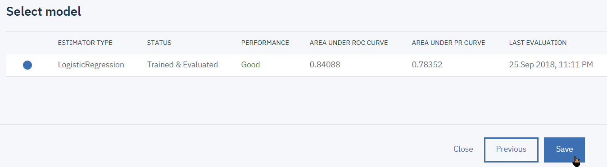
1. Configure the  retraining feedback database
    1. Switch to the Evaluation tab and select the Configure Performance Monitoring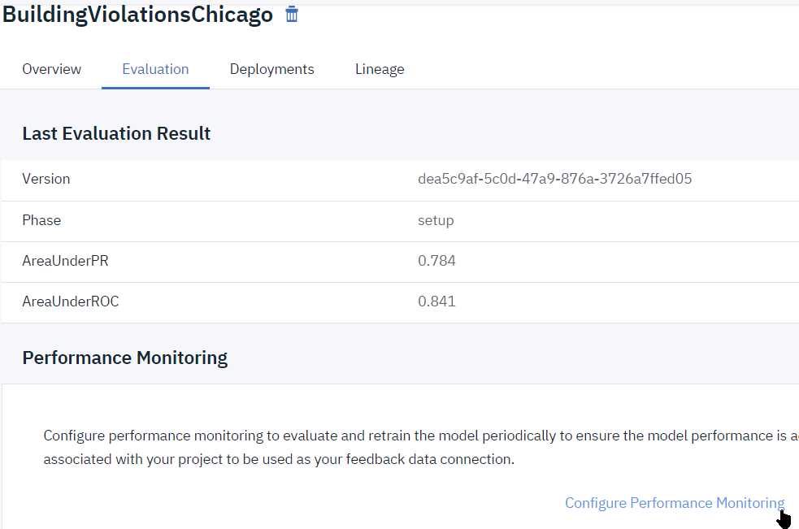
    1. Select `Area under PR` as the metric with a value of 0.8 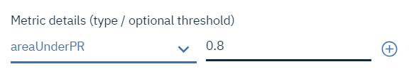
    1. Configure the feedback database, click on Create New Connection: 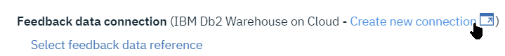
    1. Select **`DB2 Warehouse`** as the database type: 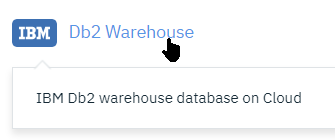
    1. Enter the DB name `BLUDB`, and the userid, password and hostname provided by the instructor, a name such as `DB2` then click to `Create` the connection: 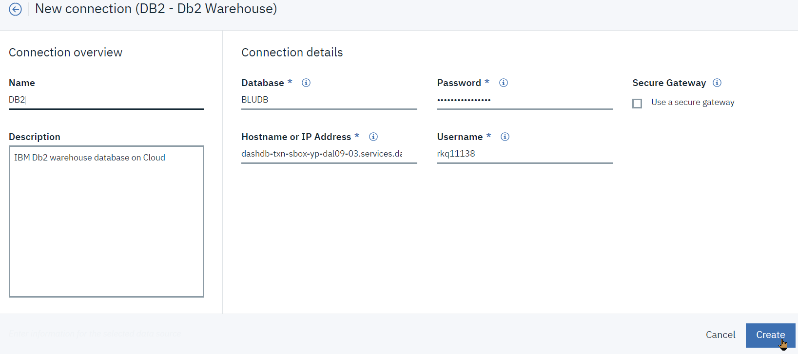
    1. Back to the Model Evaluation, click 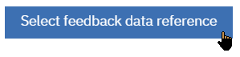
    1. Select any existing schema, for example `ST_INFORMTN_SCHEMA` 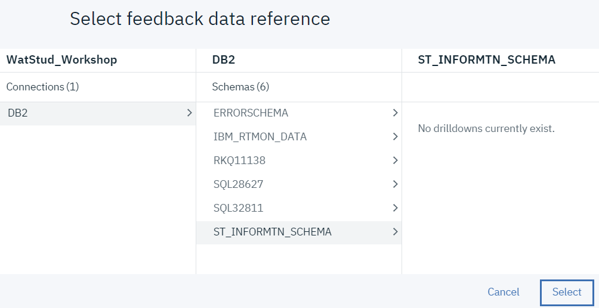
    1. Enter a table name, **which must be unique among the participants since we're all sharing the same database**, use e.g. `New2017Table_XYZ` where `XYZ` are your initials: 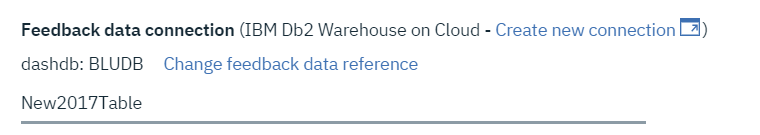
    1. Keep the defaults for Auto retrain and deploy, and finally click Save: 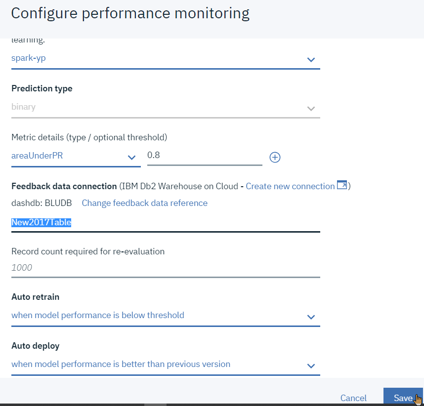
1. Adding new feedback data:
    1. From the model Evaluation tab, click the `(+) Add feedback data` button 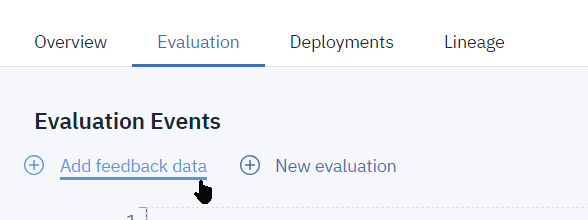
    1. Select one of the files from the `months.zip` file that you will have unzipped, starting in October, e.g. `buildings_violations_October.csv`
    1. This will prompt for a new evaluation: 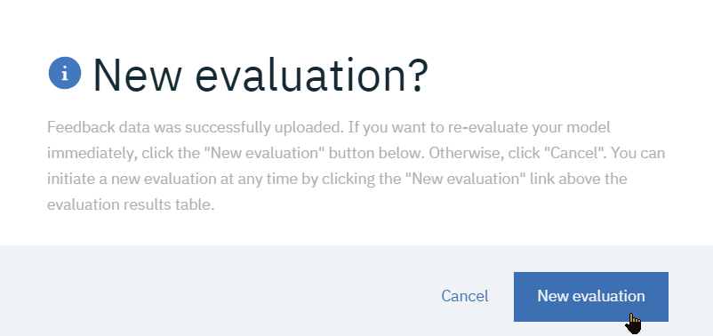
    1. The model will retrain and show the new values for the performance indicators: 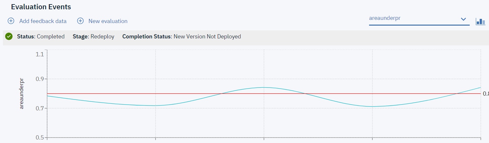

# Conclusion
This short hands-on lab's purpose is to give a taste for the tasks involved in retraining and continuous learning of a model.  
We have seen how injecting fresh up-to-date data can be used to re-evaluate a model against its quality indicators.